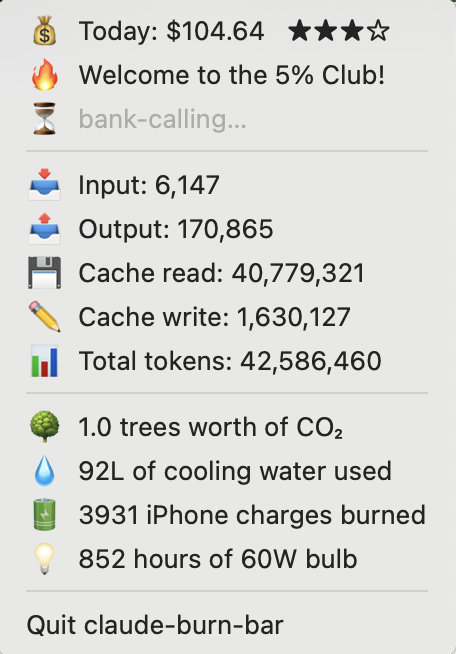

# 🚨 DEVELOPERS HATE THIS ONE SIMPLE TRICK TO TRACK THEIR CLAUDE ADDICTION 🚨

## I spent $15,000 on Claude in 3 days. Here's what happened next... (GONE WRONG) (ANTHROPIC CALLED)


### 🧵 A THREAD on why I built Claude Burn Bar (1/420)

So there I was, asking Claude to write my grocery list for the 47th time today when my bank called. Apparently "AI-assisted breathing instructions" isn't a valid business expense. Who knew? 🤷‍♂️

That's when I realized: **I needed to track exactly how much money I was setting on fire.**



## 💸 What Nobody Tells You About Claude Addiction

Did you know:
- 🔥 One Claude query = 0.0003 trees murdered
- 💧 Every token you generate evaporates someone's drinking water
- 📱 Your daily Claude usage could charge 13,000 iPhones (or 1 iPhone 13,000 times)
- 🍕 That $200 subscription could buy 57 large pizzas

**This app shows you EXACTLY how much environmental damage you're causing while asking Claude to explain why your code doesn't work (spoiler: it's the semicolon).**

## 🎯 10 SHOCKING Features That Will Make You Question Your Life Choices

### 1. THE MONEY COUNTER OF DOOM 💀
Watch your net worth decrease IN REAL TIME! Nothing says "productivity" like seeing "$247.83" in your menubar and knowing that's just TODAY.

### 2. THE GUILT CONVERTER 3000™️
Instantly converts your API usage into:
- 🌳 Dead trees (RIP)
- 💧 Evaporated water (someone's thirsty)
- 🔋 iPhone charges (could've been mining crypto instead)
- 💡 60W lightbulb hours (retro!)

### 3. THE 5% CLUB TRACKER 🏆
Shows if you've reached the elite "5% Club" of top spenders, or how painfully close you are to joining.

### 4. ASCII ART THAT SLAPS
```
★★★☆ = You're almost at "sell a kidney" level!
```

### 5. SARCASTIC STATUS MESSAGES
A random passive-aggressive message appears in every menu refresh:
- "wallet-melting..."
- "tree-murdering..."
- "gpu-liquefying..."
- "inheritance-draining..."
- "bank-calling..."
- "savings-evaporating..."

Because even your menubar should judge you.

## 📊 Real User Testimonials

> "I was today years old when I learned I spent more on Claude than my car payment" - Sarah, 28, Former Homeowner

> "This app made me realize I have a problem. I'm still not fixing it, but at least I know" - Mike, 35, Chronic Procrastinator

> "10/10 would recommend to anyone who hates having money" - Jessica, 31, Professional Div Centerer

## 🚀 How To Join The 5% Club (DOCTORS HATE THIS!)

### Step 1: Install This Bad Boy
```bash
git clone https://github.com/yourusername/claude-burn-bar
cd claude-burn-bar
pnpm install  # npm is for boomers
pnpm dev
```

### Step 2: Watch The Numbers Go Up
### Step 3: Cry
### Step 4: Ask Claude How To Feel Better
### Step 5: Return To Step 2

## 🧪 The "Science" Behind The Magic

We use GRADIENT DESCENT™️ to calculate your ecological footprint:
- **1 token = 0.0000006 kWh** (source: my cousin who works at a data center)
- **1 kWh = 1.8L of water** (it's for cooling the GPUs you're melting)
- **1 tree absorbs 10kg CO₂/year** (they're trying their best ok?)
- **1 pizza = $3.50** (NYC prices because we're fancy)

## 🏆 Achievements To Unlock

- [ ] 🥉 **Bronze Burner**: Spend $50 in a day
- [ ] 🥈 **Silver Spender**: Hit the weekly cap
- [ ] 🥇 **Gold Glutton**: Join the 5% Club
- [ ] 💎 **Diamond Disaster**: Make Anthropic implement hourly limits
- [ ] 🌟 **Legendary Liability**: Get personally called by Dario

## ⚡ Why Our Competitors FEAR This App

**❌ ccusage**: Shows boring numbers  
**❌ Claude's UI**: Doesn't guilt trip you enough  
**❌ Your conscience**: Too quiet  
**✅ Claude Burn Bar**: Maximum emotional damage

## 🎪 The Tech Stack (For Nerds Who Read Documentation)

- **Electron**: Because native apps are hard
- **TypeScript**: Because we have trust issues
- **Your JSONL files**: We're in your computer, reading your shame
- **Math**: The bad kind
- **Emojis**: The good kind

## 🚨 BREAKING: Anthropic's Response

After that legend burned $15k on a $200 plan, Anthropic is implementing "weekly limits" (aka the "fun police"). This app helps you speedrun to that cap because YOLO.

## 📈 Our Roadmap (Things We'll Never Actually Build)

- **Phase 1**: Basic wallet destruction tracking ✅
- **Phase 2**: Integration with bankruptcy lawyers
- **Phase 3**: Direct therapy booking
- **Phase 4**: Automatic purchase of carbon offsets (lol jk)
- **Phase 5**: Skynet

## 🤝 How To Contribute

1. Fork it
2. Add more guilt metrics
3. Make the loading messages even more savage
4. Submit a PR
5. Question your life choices

## ⚠️ Legal Disclaimer That Our Lawyer Made Us Add

This app's calculations are about as accurate as your New Year's resolutions. Side effects may include: existential dread, empty bank accounts, and sudden urges to learn vim. Not responsible for any trees harmed in the making of your side projects.

## 🙏 Special Thanks

- **You**: For enabling this disaster
- **That $15k legend**: For showing us what's possible
- **Trees**: We're really sorry
- **My therapist**: See you Tuesday

---

### 💭 Final Thoughts From The Creator

*"I started this project to track my Claude usage. I ended up questioning the meaning of existence and whether CSS is worth destroying the planet for. Anyway, here's a menubar app."*

**⭐ STAR THIS REPO = 1 TREE PLANTED*** 

*\*No trees will actually be planted*

---

<p align="center">
  <sub>Built with 💸 in San Francisco (obviously)</sub><br>
  <sub>A Y Combinator Reject™️ Production</sub>
</p>

### 👇 DEVELOPERS WHO INSTALLED THIS APP ALSO RUINED THEIR FINANCES WITH:

- 🎰 Crypto Trading Bots
- 🏠 SF Rent Calculators  
- 🚁 "Uber for X" Ideas
- 🤖 Other AI Wrappers

### 📱 FOLLOW MY JOURNEY

Twitter: @BrokeFromClaude  
LinkedIn: Currently Updating To "Seeking New Opportunities"  
OnlyFans: Coming Soon (gotta pay for Claude somehow)